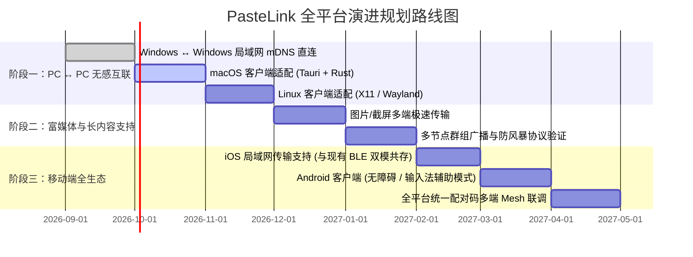

# PasteLink · 全平台通用剪贴板架构设计与演进路线图

> **目标愿景**：  
> **只要安装本软件，并在设备间输入相同的安全配对码，即可实现任意平台（Windows / macOS / Linux / iOS / Android）之间的无缝秒级剪贴板互通。**  
> 坚持 **Local-First（本地优先）**、**Zero-Trust（零信任端到端加密）**、**零中心化云端依赖**。

---

## 目录
1. [规划定位与核心体验哲学](#1-规划定位与核心体验哲学)
2. [各平台运行特性与系统沙盒权限边界](#2-各平台运行特性与系统沙盒权限边界)
3. [通信底层演进：从「纯 BLE」升级为「局域网 + BLE」混合双模](#3-通信底层演进从纯-ble升级为局域网--ble混合双模)
4. [分布式安全模型与多节点拓扑](#4-分布式安全模型与多节点拓扑)
5. [多节点防回环与风暴控制设计](#5-多节点防回环与风暴控制设计)
6. [分阶段落地演进路线图 (Roadmap)](#6-分阶段落地演进路线图-roadmap)
7. [核心技术选型与网络协议草案](#7-核心技术选型与网络协议草案)

---

## 1. 规划定位与核心体验哲学

### 1.1 核心公式
$$\text{任意设备} + \text{安装 PasteLink} + \text{匹配相同配对码} = \text{安全互联、秒级复制粘贴}$$

### 1.2 体验差异化原则
* **桌面电脑端（PC ↔ PC）**：实现 **100% 双方完全无感**。在 A 电脑按 <kbd>Ctrl+C</kbd>，B 电脑剪贴板已被静默更新，直接按 <kbd>Ctrl+V</kbd> 即可使用；
* **移动终端（Phone ↔ PC / Phone ↔ Phone）**：严格遵守移动端隐私规范，保持 **最多一次极简操作（Pull on Demand）**，通过侧边按键、控制中心、小组件或前台悬浮窗一键直达，杜绝任何高频通知骚扰。

---

## 2. 各平台运行特性与系统沙盒权限边界

在跨平台架构设计中，必须直面不同操作系统的隐私权限机制：

| 平台 | 角色类型 | 后台静默读剪贴板 | 后台静默写剪贴板 | 系统权限挑战与实现方案 |
| :--- | :--- | :---: | :---: | :--- |
| **Windows** | PC 核心节点 | ✅ 允许 | ✅ 允许 | **已就绪**。Win32 API（`GetClipboardData` / `AddClipboardFormatListener`），全局热键与托盘常驻。 |
| **macOS** | PC 核心节点 | ✅ 允许 | ✅ 允许 | **完全可行**。基于 `NSPasteboard` 轮询/监听，常驻 Menu Bar 托盘，Rust (Tauri) 原生复用。 |
| **Linux** | PC 核心节点 | ✅ 允许 | ✅ 允许 | **完全可行**。支持 X11 (`xclip`) 与 Wayland (`wl-clipboard`)，Rust 生态极佳。 |
| **iOS / iPadOS** | 移动节点 | ❌ 系统禁止 | ❌ 系统禁止 | **按需交互直达**。苹果严格禁止后台 App 偷读剪贴板（iOS 14+ 弹横幅，iOS 16+ 需授权）。必须依托 **Action Button（操作按钮）**、**iOS 18 控制中心按钮**、**小组件（AppIntents）** 或打开 App 时瞬间写入。 |
| **Android** | 移动节点 | ⚠️ 严格受限 | ⚠️ 严格受限 | **条件可行**。Android 10+（API 29+）禁止普通后台应用监听剪贴板；可提供两种方案：<br>1. **轻量模式**：常驻前台服务通知栏 / 悬浮球一键粘贴；<br>2. **无感模式**：开启系统「无障碍辅助功能 (Accessibility)」或注册为「备用输入法 (IME)」，即可获得全局剪贴板变更监听。 |

---

## 3. 通信底层演进：从「纯 BLE」升级为「局域网 + BLE」混合双模

目前实现的 Windows ↔ iOS 采用纯低功耗蓝牙（BLE GATT）。为实现全平台任意节点互联，必须引入局域网协议：

```
                    ┌────────────────────────┐
                    │      PasteLink 客户端   │
                    └───────────┬────────────┘
                                │ 动态选择最优先链路
                 ┌──────────────┴──────────────┐
                 ▼                             ▼
        【主力通道：局域网 LAN】           【备用通道：低功耗蓝牙 BLE】
        • mDNS / UDP 局域网自动发现        • BLE 5.0 GATT 广播与连接
        • TCP / TLS 本地对等加密流         • 零网络依赖（户外/无Wi-Fi保底）
        • 带宽无限制 (支持大图片/文本)       • 传输上限 64 KB (纯文本适用)
        • 毫秒级极速响应                  • 低功耗，移动端友好
```

### 3.1 为什么必须吸纳局域网（LAN / Wi-Fi）？
1. **解除物理带宽瓶颈**：BLE 空口速率仅 10~50 KB/s，传输大段代码需要分片，且**完全无法传输高分辨率截图或富媒体**。局域网可轻松秒传数兆图片；
2. **克服 PC 硬件差异**：大量组装台式机没有蓝牙模块，或便宜的 USB 蓝牙适配器不支持 Peripheral 广播模式；而局域网（Wi-Fi 或有线网）是所有电脑的标配；
3. **摆脱 Mesh 网状连接复杂性**：在蓝牙中，多对多连接会导致射频芯片拥塞；而在局域网中，基于 UDP 组播发现 + TCP 直连建立多节点连接非常成熟且极其稳定。

---

## 4. 分布式安全模型与多节点拓扑

用户规划：“**只要配对码匹配上，就能实现任何设备互通**”。采用去中心化群组密钥（Group PSK）架构实现：

### 4.1 密钥派生体系 (Zero-Trust Key Derivation)
1. **配对码 (PIN Code)**：用户在设备上设置相同的 6 位或自定义强口令（如 `888 666`）；
2. **派生主密钥**：通过 **HKDF-SHA256** 或 **Argon2id**，将配对码派生为 256 位全局加密对称密钥 $K_{master}$；
3. **数据加解密**：传输载荷使用 **AES-256-GCM**，每个数据包附加随机 12 字节 Nonce，确保前向安全和防篡改；
4. **免配置对齐**：只要新设备的配对码正确，即可瞬间解密接收到的局域网数据包，无须在各设备间繁琐地点对点重新授权。

### 4.2 局域网服务发现与握手（mDNS / UDP Beacon）
* 设备启动后在本地局域网监听端口（如 `52088`）；
* 广播 `_pastelink._tcp.local` mDNS 服务，广播元数据包含：
  * `deviceId`: 设备唯一持久化 UUID
  * `deviceName`: 友好名称（如 `Bob-Desktop`、`iPhone 16 Pro`）
  * `authProof`: $H(K_{master} \parallel \text{当日日期戳})$（用于证明持有相同配对码，而不暴露明文）
* 发现同配对码设备后，自动建立双向 TLS/TCP 本地加密通道。

---

## 5. 多节点防回环与风暴控制设计

在多设备（如 2 台 Windows + 1 台 Mac + 2 部手机）网络中，如果设备 A 复制并广播，设备 B 收到写回剪贴板，若机制不完善会导致设备 B 误以为是本地新复制并再次广播，引发**网络无限回环广播风暴**。

### 防回环核心控制协议：
1. **消息包结构定义**：
   ```json
   {
     "msg_id": "c1f7b8...uuid",
     "origin_device_id": "win-desktop-01",
     "timestamp": 1756980000000,
     "sha256": "e3b0c44298fc1c149afbf4c8996fb92427ae41e4649b934ca495991b7852b855",
     "hop_count": 0,
     "item_type": "text | image | url | code",
     "payload": "<AES-256-GCM Encrypted Base64>"
   }
   ```
2. **单跳规则（Single-Hop Only）**：
   * 仅有原始产生复制动作的设备（`hop_count = 0`）有权发起跨设备同步；
   * 任何收到同步包的接收端，必须强制标记为 `hop_count = 1`，写入本地剪贴板时**严格禁止二次向外转发**；
3. **全局 SHA-256 环形指纹池**：
   * 所有设备本地维护最近 100 条历史 Hash。无论是本地被动写入还是主动复制，先录入防回环池，若 Hash 命中则直接忽略。

---

## 6. 分阶段落地演进路线图 (Roadmap)



### 阶段详细规划：

#### 阶段一：打通 PC ↔ PC 跨端（Win ↔ Win / Win ↔ Mac / Win ↔ Linux）
* **核心目标**：实现两台或多台电脑之间的无感复制（Ctrl+C 即可粘贴）；
* **关键改造**：
  * 在当前 Tauri/Rust 架构中引入 `mdns-sd` 或 `tokio` TCP 局域网监听中枢；
  * 实现电脑与电脑间的自动发现与密钥握手；
  * 打包跨平台客户端（Windows x64 / macOS dmg / Linux deb）。

#### 阶段二：突破纯文本限制，支持系统图片与截图同步
* **核心目标**：按下系统截图快捷键（如 Win+Shift+S / Command+Shift+4），其他电脑和手机能瞬间收到图片；
* **关键改造**：
  * 扩展剪贴板监听，支持 `PNG / DIB / JPEG` 图像格式；
  * 在局域网大带宽通道上分片传输二进制流；
  * 剪贴板历史列表支持图片缩略图预览与一键另存。

#### 阶段三：覆盖移动端全生态（iOS 双模 + Android 客户端）
* **核心目标**：手机与所有电脑自由互联；
* **关键改造**：
  * **iOS**：保留现有的 BLE 离线能力，同时引入 Network.framework 监听局域网连接；
  * **Android**：基于 Kotlin / Compose 开发原生客户端，利用前台服务及 AccessibilityService 实现后台剪贴板静默同步。

---

## 7. 核心技术选型与网络协议草案

* **核心共享逻辑**：Rust 统一核心库（加解密、防回环池、分包切片、mDNS 解析）；
* **PC 端 UI**：Tauri 2.0 + React + TypeScript + Fluent / Native 样式；
* **iOS 端**：SwiftUI + CoreBluetooth + Network.framework + AppIntents / WidgetKit；
* **Android 端**：Kotlin + Jetpack Compose + AccessibilityService；
* **默认发现端口**：`UDP 52088` (mDNS / Broadcast)；
* **默认直传端口**：`TCP 52089` (TLS 1.3 / AES-GCM Encrypted)。

---

## 8. 文档归档说明
* 本规划已由 PasteLink 架构团队于 2026 年 9 月完成推演并归档于 `docs/universal_cross_platform_clipboard_roadmap.md`；
* 当前代码库已完整实现第一阶段的 **Windows (GATT Peripheral) ↔ iOS (Central) 纯 BLE 加密文本链路**；后续推进新功能时，以此文档作为顶层设计基准。
